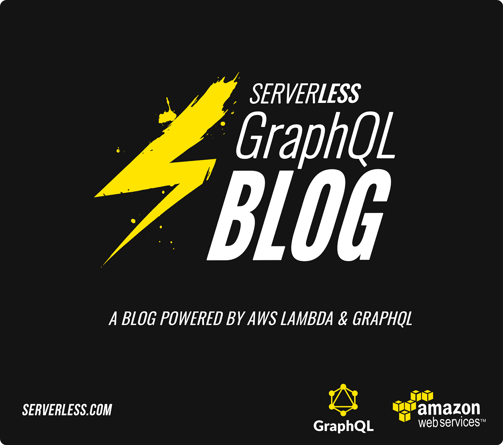
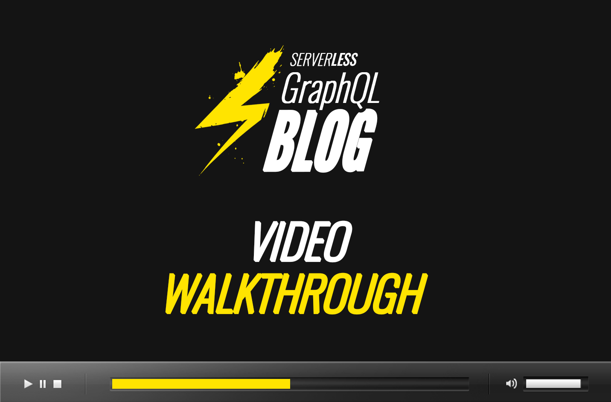

#serverless-graphql-blog

This [Serverless Framework](http://www.serverless.com) Project creates a REST API for a basic blog structure, including Posts, Authors and Comments utilizing [GraphQL][1] and DynamoDB for persistent storage.  What's unique about this implementation is the entire REST API consists of only 1 endpoint.

Note: This project automatically creates 3 DynamoDB tables upon `serverless project install`.  They are defined in `s-project.json`.

* [Blog Post](http://kevinold.com/2016/02/01/serverless-graphql.html)
* [Video Walkthrough](https://www.youtube.com/watch?v=lgE5-mm8gX4)
* [Email Updates](http://eepurl.com/bvz5Nj)
* [Gitter Chat Room](https://gitter.im/serverless/serverless)
* [Serverless Documentation](http://docs.serverless.com)
* [Twitter](https://www.twitter.com/goserverless)

Enjoy,<br/>
Kevin Old ([Twitter](https://twitter.com/kevinold))

## Install & Deploy

Make sure you have the most recent version of the [Serverless Framework](http://www.serverless.com) and you are using NodeV4 or greater.

```
npm install serverless -g
```

Install this Serverless Project:

```
serverless project install serverless-graphql-blog
```

View project summary:

```
serverless dash summary
```
Deploy the project's Function and Endpoint:

```
serverless dash deploy
```

[](https://www.youtube.com/watch?v=lgE5-mm8gX4)

### Querying with GraphiQL

The [graphql-js][1] endpoint provided in this Serverless Project is compatible with [GraphiQL][2], a query visualization tool used with [graphql-js][1].

Usage with [GraphiQL.app][3] (an Electron wrapper around [GraphiQL][2]) is recommended and is shown below:


### Sample GraphQL queries

#### List of author names
```
curl -XPOST -d '{"query": "{ authors { name } }"}' <endpoint>/dev/resource/graphql
```

#### Results
```
{
  "data":{
    "authors":[
      {"name":"Kevin"}
    ]
  }
}
```

### List of posts with id and title
```
curl -XPOST -d '{"query": "{ posts { id, title } }"}' <endpoint>/dev/resource/graphql
```

#### Results
```
{
  "data": {
    "posts": [
      { "id":"1",
        "title":"First Post Title"
      }
    ]
  }
}
```

#### List of posts with id, title and *nested* author name
```
curl -XPOST -d '{"query": "{ posts { id, title, author { name } } }"}' <endpoint>/dev/resource/graphql
```

#### Results
```
{
  "data": {
    "posts": [
      { "id":"1",
        "title":"First Post Title",
        "author":{
          "name":"Kevin"
        }
      }
    ]
  }
}
```

#### List of posts with post, author and comments information (for a Post with no comments, i.e. comments:[])
```
curl -XPOST -d '{"query": "{ posts { id, title, author { id, name }, comments { id, content, author { name } } } }"}' <endpoint>/dev/resource/graphql
```

#### Results
```
{
  "data":{
    "posts":[
    {
      "id":"1",
        "title":"First Post Title",
        "author":{
          "id":"1",
          "name":"Kevin"
        },
        "comments":[]
    }
    ]
  }
}
```


### Sample GraphQL Mutations

#### Create Post
```
curl -XPOST -d '{"query": "mutation createNewPost { post: createPost (id: \"5\", title: \"Fifth post!\", bodyContent: \"Test content\", author: \"1\") { id, title } }"}' <endpoint>/dev/resource/graphql
```

#### Results
```
{
  "data":{
    "post":{
      "id":"5",
      "title":"Fifth post!"
    }
  }
}
```


#### Mutation Validation

Validations defined using [graphql-custom-types][4] in [blog/lib/schema.js][5]
```
curl -XPOST -d '{"query": "mutation createNewPost { post: createPost (id: \"8\", title: \"123456789\", bodyContent: \"Test content 5\") { id, title } }"}' <endpoint>/dev/resource/graphql
```

#### Results
```
{
  "errors":[
  {
    "message":"Query error: String not long enough"}
  ]
}
```


### Introspection Query
```
curl -XPOST -d '{"query": "{__schema { queryType { name, fields { name, description} }}}"}' <endpoint>/dev/resource/graphql
```

Returns:
```
{
  "data":{
    "__schema":{
      "queryType":{
        "name":"BlogSchema",
          "fields":[
          {
            "name":"posts",
            "description":"List of posts in the blog"
          },
          {
            "name":"authors",
            "description":"List of Authors"
          },
          {
            "name":"author",
            "description":"Get Author by id"
          }
        ]
      }
    }
  }
}
```

[1]: https://github.com/graphql/graphql-js
[2]: https://github.com/graphql/graphiql
[3]: https://github.com/skevy/graphiql-app
[4]: https://github.com/stylesuxx/graphql-custom-types
[5]: https://github.com/serverless/serverless-graphql-blog/blob/master/blog/lib/schema.js#L100
